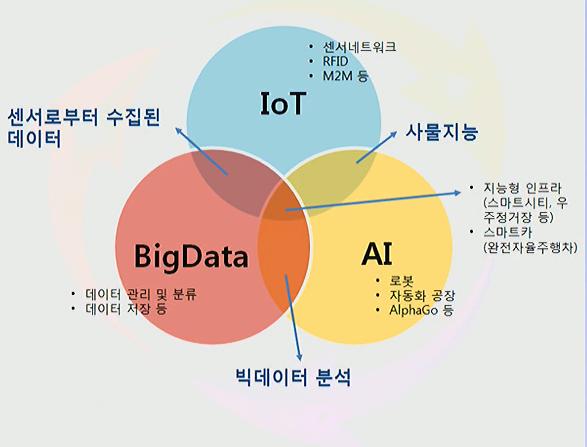
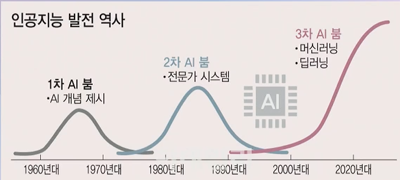
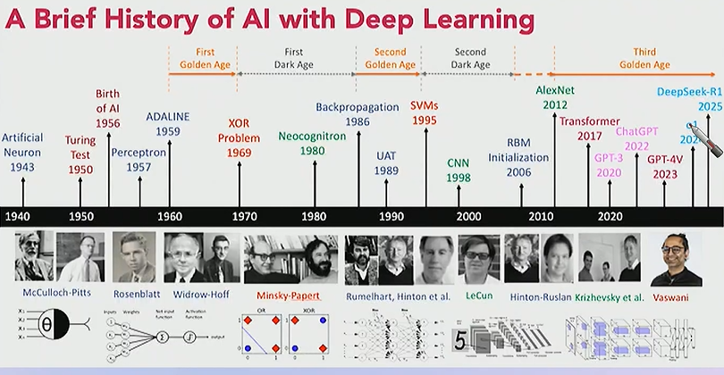

# 인공지능

- 인간이 지닌 지적 능력 일부/전체를 **인공적으로 구현**하기 위한 기술
- **데이터로부터 스스로 학습/지식을 축적. 의미 있는 정보 도출**

### 인공지능 ⊃ 머신러닝 ⊃ 딥러닝

- **인공지능** - 사고나 학습 등 인간이 가진 지적 능력을 컴퓨터를 통해 구현하는 기술
- **머신 러닝(기계학습)** - 컴퓨터가 스스로 학습하여 인공지능의 성능을 향상 시키는 기술 방법
- **딥러닝(심층학습)** - 인간의 뉴런과 비슷한 인공신경망 방식으로 정보를 처리

## 기계학습의 종류

| 종류 | 방법 | 훈련 데이터 | 사용 목적 |
| --- | --- | --- | --- |
| 지도 학습 Supervised Learning | 분류(Logistics Regression), 예측(Liner Regression) | 있음 | 분류 및 예측 |
| 비지도 학습 Unsupervised Learning | 군집(Clustering) | 없음 | 데이터 분석 |
| 강화 학습 Reinforcement Learning | 이용(Exploitation), 탐험(Exploration) | 에이전트, 환경, 행동 및 보상 | 최적 선택 |

### 인공지능과 빅데이터의 관계

## 인공지능 발전사

### 딥러닝 발전사

XOR Problem 1969: 1st AI’s winter

## 인공지능의 구분

||||
| --- | --- | --- |
| 약 인공지능 Week AI Atrificial Narrow Intelligence ANI | 주어진 조건 아래에서만 작동 가능 | 구글 맵스, 자율자동차, 구글번역, 페이스북 추천 |
| 강인공지능 Strong AI Atrificial General Intelligence AGI | 인간과 같은 사고가 가능한 인공지능 | 터미네이터, 비서 로봇, 공장 로봇 |
| 초인공지능 Atrificial Super Intelligence ASI | 모든 영역에서 인간을 훨씬 뛰어넘는 인공지능 | “인류가 앞으로 1000년 동안 쓸 수 있는 신 에너지원을 만들어 내 봐” 와 같은 고차원의 명령도 가능 |

## AI 시대의 교육

- 교육 방식 변화 필요
    - 일대일 교육
    - 개별화된 교육
    - 암기 위주의 교육 탈피
    - 이론의 응용과 활용 중요
- 교육 평가 변화 필요
    - 새로운 평가 도구 필요

## AI 시대의 신규 직업

- AI와 협업 및 경쟁 고려
- 사람에 대한 직업은 여전히 중요
- 신규 직업에 대한 열린 자세 필요