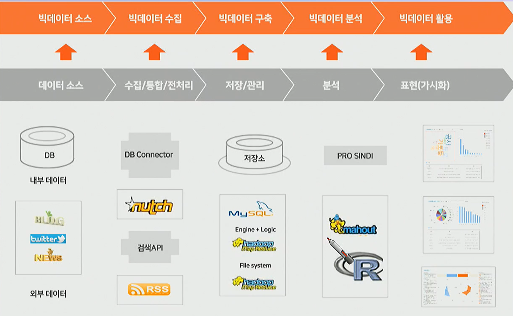
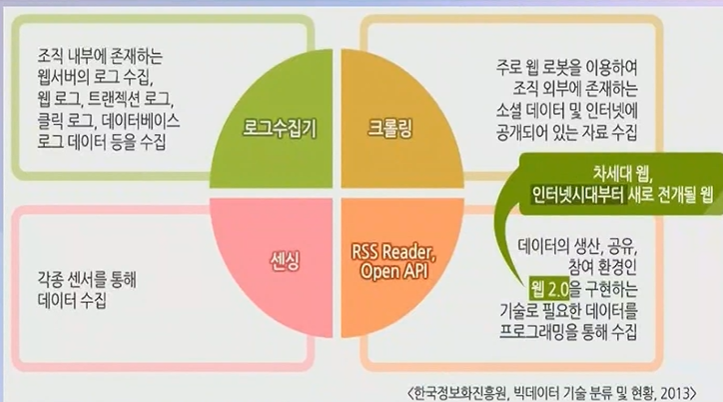
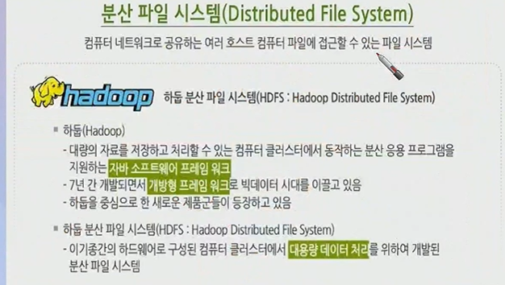
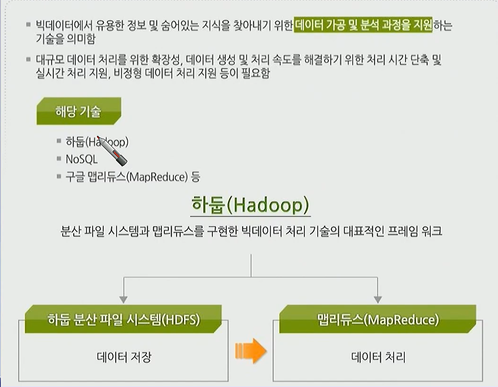
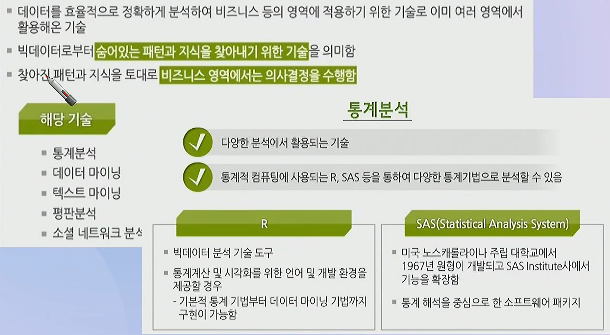
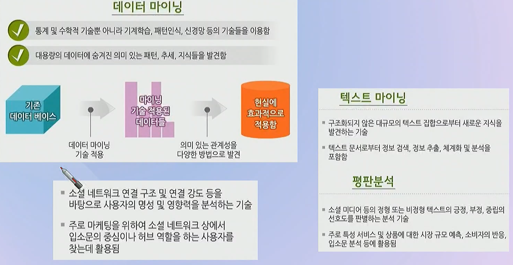
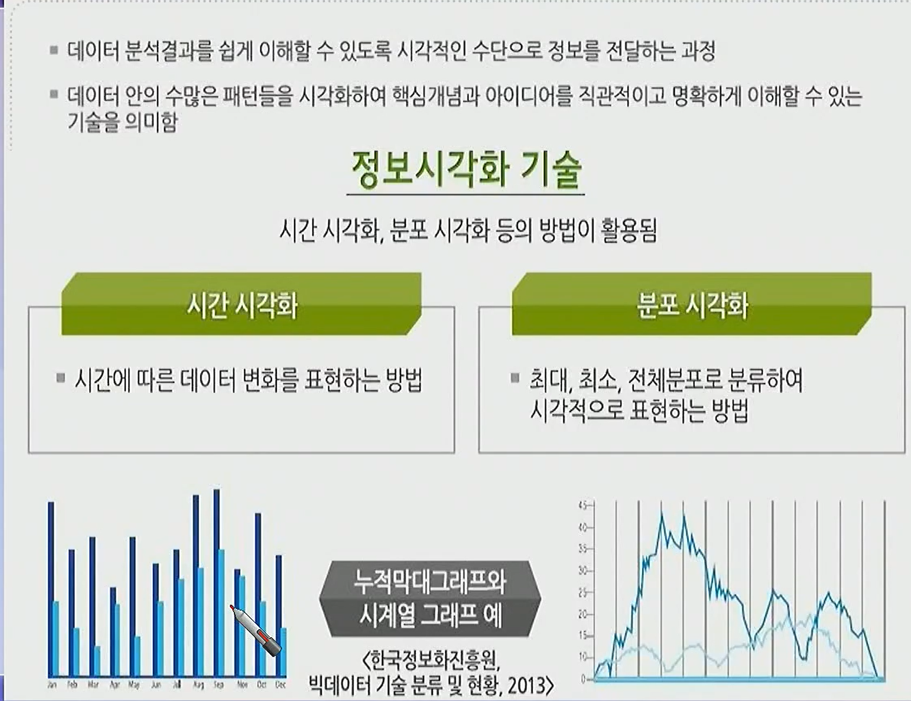

# 빅데이터의 정의

- Gartner
    - 고급 통찰력 및 의사결정을 위해 비용효과적인 혁신적 정보처리 과정을 필요로 하는 방대하고 빠르게 증가하는 다양한 정보 자산
    - **대용량, 빠른 속도, 다양성 높은 정보 자산**
- 삼성 경제 연구소
    - 기존의 관리 및 분석 체계로는 감당할 수 없을 정도의 거대한 데이터의 집합을 지칭.
    - 대규모 데이터와 관련된 기술 및 도구를 포함
- 데이터 규모에 초점 → 기존 데이터베이스 관리도구의 데이터 수집, 저장, 관리, 분석 역량을 넘어서는 데이터
- 업무 수행 방식에 초점 → 다양한 종류의 대규모 데이터로부터 저렴한 비용으로 가치를 추출하고 데이터의 빠른 수집, 발굴, 분석을 지원하도록 고안된 차세대 기술 및 아키텍처
- 3V: Volume(데이터량), Velocity(처리, 분석 속도), Variety(다양한 데이터 종류)
    - + Value(수집되는 데이터의 가치)

### 데이터의 종류

| 정형 데이터 Structured data | 비정형 데이터 Unstructured data | 반정형 데이터 Semi-structured data |
| --- | --- | --- |
| 고정된 필드에 저장된 데이터 | 형태와 구조가 복잡한 데이터 | 값과 형식이 다소 일관성이 없는 데이터 |
| 관계형 데이터베이스, 스프레드시트 | 소셜 데이터 문서, 이미지, 오디오, 비디오, 동영상 | HTML, XML, 웹문서, 웹로그, 센서 데이터 |

### 인력 요소

- 데이터 사이언티스트 - 대규모 데이터 속에서 숨겨진 정보를 찾아내 제품이나 서비스를 개선하는 직업

### 빅데이터 수집

### 빅데이터 저장, 처리

- 하둡: 분산 파일 시스템과 맵 리듀스를 구현한 빅데이터 처리 기술의 대표적인 프레임 워크

SQL → NoSQL → NewSQL

- 하둡 사용 감소의 이유
    - MapReduce는 디스크 기반 처리로 속도가 느림
        - Spark 등 메모리 기반 처리 엔진 등장
        - 실시간 데이터 처리에 부적합
    - S3, GCS 등 오브젝트 스토리지 등장
        - 서버리스 분석 플랫폼 확산
        - HDFS 사용 이유 감소
    - 온프레미스 클러스터(여러대의 서버를 직접 설치) 유지 비용 높음
        - 수십-수백 대 서버 관리 필요
        - **클라우드 기반 처리 플랫폼으로 이동**
- 하둡 대체 기술
    - 메모리 기반 고속 철
        - SQL, MLib, Streaming 등 통합 기능
        - 클라우드 기반 Spark(EMR, Dataproc) 대세
    - 서버리스 클라우드 데이터 웨어하우스
        - 대규모 SQL 분석을 실시간 처리
        - 운영, 관리 부담 거의 없음

### 빅데이터 분석 기술

텍스트 마이닝

### 빅데이터 시각화

