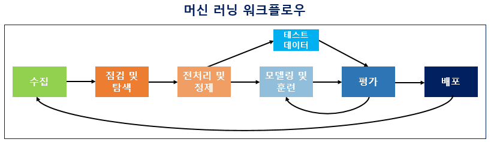
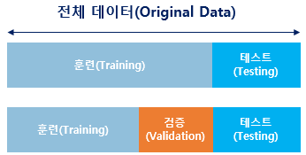
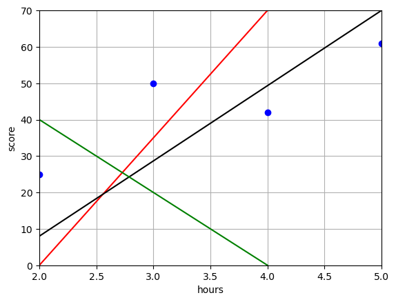
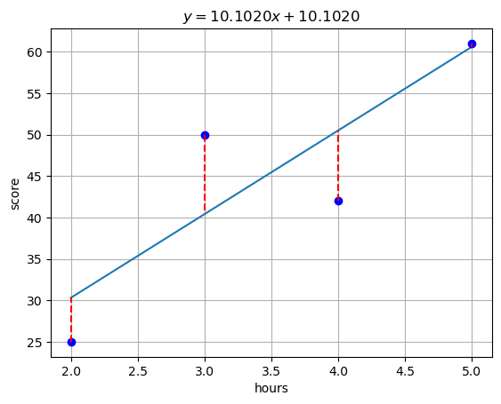

# 머신 러닝
*참고: [위키독스- 01-05 머신 러닝 워크플로우](https://wikidocs.net/31947)*
*참고: [위키독스- 06-02 머신 러닝 훓어보기](https://wikidocs.net/32012)*

## 머신 러닝 워크플로우



1.  **수집** (Acquisition): 기계를 학습시키기 위한 데이터를 모으는 단계.  
    자연어 처리에서는 자연어 데이터를 말뭉치(Corpus, 조사나 연구 목적에 의해 특정 도메인으로부터 스집된 텍스트 집합)라고 부르며, 텍스트 데이터(txt, csv, xml 등)를 음성, 웹 크롤링 등 다양한 출처로부터 수집함.

2. **점검 및 탐색** (Inspection and Exploration): 독립 변수, 종속 변수, 변수 유형, 변수의 데이터 타입 등을 점검하며 데이터의 특징과 내제하는 구조적 관계를 알아내는 단계.  
    수집된 데이터의 구조와 특징을 파악하는 탐색적 데이터 분석(EDA) 단계.  
    변수 유형, 데이터 타입, 노이즈 등을 점검하며 시각화나 통계 분석을 통해 데이터 간의 상관관계를 파악함.

3. **전처리 및 정제** (Preprocessing and Cleaning): 수집된 원본 데이터를 기계가 학습하기 좋은 형태로 가공하는 단계.  
    토큰화, 불용어 제거, 정규화 등이 포함되며, 워크플로우 중 가장 까다롭고 손이 많이 가는 과정입니다.

4. **모델링 및 훈련** (Modeling and Training): 적절한 알고리즘을 선택해 모델을 구축하고 학습시키는 단계.

    데이터 분할: 성능 측정과 과적합(Overfitting) 방지를 위해 데이터를 세 가지로 나누는 것이 권장됨.

    

    훈련용(Train): 기계 학습용 (학습지). **테스트에 활용 금지**  
    검증용(Validation): 학습 중간 점검 및 모델 개선용 (모의고사)  
    테스트용(Test): 최종 성능 수치화 및 평가용 (수능 시험). **학습에 활용 금지**

5. **평가** (Evaluation): 학습을 마친 모델의 성능을 테스트용 데이터로 검증하는 단계.  
    기계가 내놓은 예측값과 실제 정답이 얼마나 일치하는지를 측정하여 모델의 정확도를 확인.

6. **배포** (Deployment): 평가 결과가 만족스러울 경우, 모델을 실제 서비스 환경에 적용하는 단계.  
    실제 운영 중 발생하는 피드백이나 성능 저하에 따라 다시 **1단계(수집)**로 돌아가 모델을 업데이트하는 순환 구조를 가짐.

## 머신 러닝 모델의 평가
- 훈련 데이터: 머신 러닝 모델을 학습하기 위한 데이터
- 테스트 데이터: 학습한 머신 러닝 모델의 성능을 평가하기 위한 데이터
- 검증 데이터: 모델의 성능을 조절하기위한 데이터. 훈련 데이터에 과적합이 되고 있는지 판단하거나 하이퍼파라미터의 조정을 위한 용도  
    *하이퍼파라미터(초매개변수) : 모델의 성능에 영향을 주는 사람이 값을 지정하는 변수.*  
    *매개변수 : 가중치와 편향. 학습을 하는 동안 값이 계속해서 변하는 수.*


## 샘플(Sample)과 특성(Feature)
- 샘플: 하나의 데이터, 하나의 행(행렬 관점)
- 특성: 종속 변수 y를 예측하기 위한 독립 변수 x, 하나의 열(행렬 관점)  

    $\begin{bmatrix} Sample_1 & Sample_2 & \cdots & Sample_n \\ x_1 & x_2 & \cdots & x_n & Feature_1 \\ x_1 & x_2 & \cdots & x_n & Feature_2 \\ \vdots & \vdots & \ddots & \vdots & \vdots \\ x_1 & x_2 & \cdots & x_n & Feature_m \end{bmatrix}$  
    
    $y = \beta_0 + \beta_1 x_1 + \beta_2 x_2 + \cdots + \beta_m x_m$

## ⭐⭐⭐혼동 행렬(Confusion Matrix)
- 정밀도(Precision): 모델이 True로 예측한 것 중에서 실제로 True인 것의 비율. $\frac{TP}{TP + FP}$
- 재현율(Recall): 실제로 True인 것 중에서 모델이 True로 예측한 것의 비율. $\frac{TP}{TP + FN}$
- 정확도(Accuracy): 모델이 올바르게 예측한 것의 비율. $\frac{TP + TN}{TP + TN + FP + FN}$

- **True Positive** (TP): 모델이 True로 예측했고 실제로도 True인 경우 **(정답)**
- False Positive (FP): 모델이 True로 예측했지만 실제로는 False인 경우 (오답)
- False Negative (FN): 모델이 False로 예측했지만 실제로는 True인 경우 (오답)
- **True Negative** (TN): 모델이 False로 예측했고 실제로도 False인 경우 **(정답)**  
    ⭐⭐⭐
    | \$결과\$예측 | 예측 True | 예측 False |
    |-------------|-------------|--------------|
    | 실제 True | TP          | FN           |
    | 실제 False | FP          | TN           |


## 벡터, 행렬, 텐서
- 벡터: 1차원 데이터
- 행렬: 2차원 데이터
- 텐서: 3차원 이상의 데이터

### 텐서
- 0차원 텐서(스칼라)
    ```python
    import numpy as np
    scalar = np.array(5)
    print('차원:', scalar.ndim)  # 차원: 0
    print('크기:', scalar.shape)  # 크기: ()
    ```
 - 1차원 텐서(벡터)
    ```python
    vector = np.array([1, 2, 3])
    print('차원:', vector.ndim)  # 차원: 1
    print('크기:', vector.shape)  # 크기: (3,)
    ```
- 2차원 텐서(행렬)
    ```python
    matrix = np.array([
            [1, 2],
            [3, 4]
        ])
    print('차원:', matrix.ndim)  # 차원: 2
    print('크기:', matrix.shape)  # 크기: (2, 2)
    ```
- 3차원 텐서(큐브)
    ```python
    tensor_3d = np.array([
            [[1, 2, 3], [3, 4, 5]],
            [[5, 6, 7], [7, 8, 9]]
        ])
    print('차원:', tensor_3d.ndim)  # 차원: 3
    print('크기:', tensor_3d.shape)  # 크기: (2, 2, 3)
    ``` 
- 4차원 텐서(Vector of Cubes)
- 5차원 텐서(Matrix of Cubes)  

---
# 선형 회귀
- 단순 선형 회귀 분석(Simple Linear Regression): 하나의 독립 변수($x$)와 하나의 종속 변수($y$) 간의 선형 관계를 모델링하는 방법.  
    $y = w x + b$  
    $w$: 가중치, $b$: 편향
- 다중 선형 회귀 분석(Multiple Linear Regression): 여러 개의 독립 변수($x_1, x_2, ..., x_m$)와 하나의 종속 변수($y$) 간의 선형 관계를 모델링하는 방법.
    $y = w_1 x_1 + w_2 x_2 + ... + w_n x_n + b$  
    $w_i$: 각 독립 변수에 대한 가중치, $b$: 편향

- 기울기와 절편을 조금씩 수정하여 데이터에 맞춘다.

### 가설 세우기
- 단순 선형 회귀 예시
    |hours(x)|score(y)|
    |--------|--------|
    |2       |25      |
    |3       |50      |
    |4       |42      |
    |5       |61      |
    가설(Hypothesis): $H(x) = w x + b$



### 비용 함수: 평균 제곱 오차

- **비용 함수**(Cost Function) 또는 **손실 함수**(Loss Function):
    - 실제값과 예측값에 대한 오차에 대한 식.
    - **목적 함수**(Objective Function): 최적화하려는 함수. 비용 함수를 최소화하는 것이 목적.
- **평균 제곱 오차**(Mean Squared Error, MSE)
    - $MSE = \frac{1}{n} \sum_{i=1}^{n} [ y_i - H(x_i) ]^2$  
    $n$: 데이터 포인트의 수, $y_i$: 실제값, $H(x_i)$: 예측값  
    ... 를 최소화한다.

    

    ```python
    import numpy as np
    import pandas as pd
    import matplotlib.pyplot as plt

    d = pd.Series([25, 50, 42, 61], index=[2,3,4,5])

    ca = {
        'w': None,
        'b': None,
        'mse': None
    }
    for w in np.linspace(-99, 99):
        for b in np.linspace(-99, 99):
            mse = ((d - (w * d.index + b))**2).mean()
            if(ca['mse'] == None or ca['mse'] > mse):
                ca['mse'] = mse
                ca['w'] = w
                ca['b'] = b

    x = np.linspace(2, 5)

    pd.Series(ca['w'] * x + ca['b'], index=x).plot()

    d.plot(style='bo', grid=True, title=rf'$y = {ca['w']:.4f}x + {ca['b']:.4f}$')

    plt.xlabel('hours')
    plt.ylabel('score')

    for x_val, y_val in d.items():
        plt.plot([x_val, x_val], [y_val, ca['w']*x_val + ca['b']], 'r--')

    ```